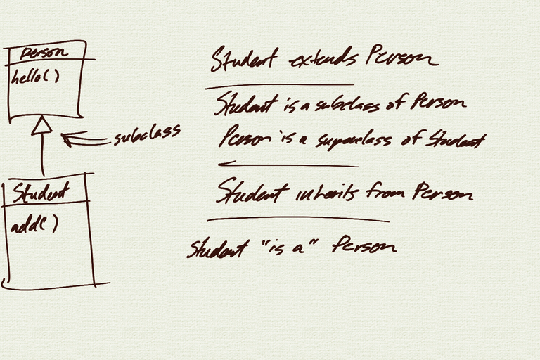

# Unit 11 - Inheritance and Interfaces

## Topics

- subclasses
- interfaces

## Demo

- <a href="../unit11_demo/Person.java">Person.java</a>
- <a href="../unit11_demo/Student.java">Student.java</a>
- <a href="../unit11_demo/Main.java">Main.java</a>

 

- <a href="../unit11_demo/Shape.java">Shape.java</a>
- <a href="../unit11_demo/ShapeTest.java">ShapeTest.java</a>
- <a href="../unit11_demo/Rectangle.java">Rectangle.java</a>
- <a href="../unit11_demo/Circle.java">Circle.java</a>

## Scenes Demo

- <a href="../scenes/Game.java">Game.java</a>
- <a href="../scenes/Scene.java">Scene.java</a>
- <a href="../scenes/StartScene.java">StartScene.java</a>
- <a href="../scenes/GameScene.java">GameScene.java</a>
- <a href="../scenes/EndScene.java">EndScene.java</a>

## Transformations Demo

- <a href="../hello_transformations/HelloTransformations.java">HelloTransformations.java</a>

