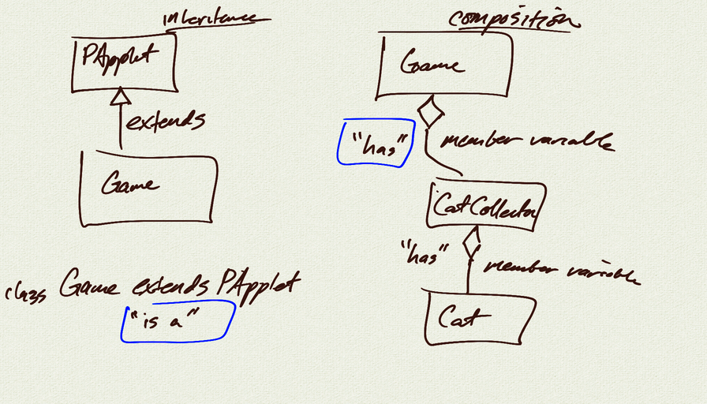

# Unit 13 - Interacting Classes

## Topics:

- class relationships
    - inheritance == 'is a'
    - composition == 'has a'
- interacting classes
- computations on member lists
 

## Demo

- <a href="../unit13_demo/Cat.java">Cat.java</a>
- <a href="../unit13_demo/CatCollection.java">CatCollection.java</a>

